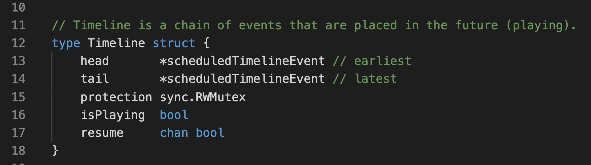

# Melrōse, program and play music

#### Ernest Micklei, October 2021

---
# Motivation

- Explore patterns in music expressed by programming constructs

- Challenge to find the right abstraction and functions

- Offer quick audio feedback

---
# What is Melrōse ?

- Language to create music, as programs

- Runtime environment to play programs

---

---
# Language Bits

 

---
# Note
 

---
# Examples: note

      note('c') 
      note('c5') // octave 5
      note('8c') // duration 1/8
      note('e#') // sharp
      note('b_') // flat

      note('.1a#3++')

Raw

      midi(2,37,72) // 1/2 duration, MIDI nr 37, velocity 72  

---
# Sequence

---
# Examples: sequence

    sequence('c d e f g a b 1c5 8c5 8a 8b 8g 8e 8f 8g (1c 1e 1g)')

    sequence('= 8a3 8b3 2c-  = 8c 8d 2e-  = 8d 8e 2f-   = 8c 8b3 2a3-')

---
# Other music primitives

    chord('c#/m')

    scale(2,'8g#3')

    progression('2c#', 'I VI II V')

    chordsequence('a3 b3 c#/m')

---
# Composition

---
# Example: composition

    y = sequence('f#2 c#3 f#3 a3 c# f# = ')
    p = resequence('3 4 2 5 1 6 2 5', y)
    f = fraction(8, p)
    
    jf = join(repeat(2,f),
        repeat(2,pitch(1,f)), 
        repeat(2,pitch(-2,f)), 
        repeat(2,pitch(3,f)))

---
# Drum patterns

`notemap` can create a sequence using `dots and bangs`.    
    
    kick = note('16c2')

    channel(10, notemap('!...!...!...!...', kick))

---
# Merge

    kick = note('c2')
    snare = note('e2')
    closehi = midi(4,42,72)

    drum14 = merge(
        notemap('!.!....!.!!!...!',kick),
        notemap('....!.......!...',snare),
        notemap('!.!.!.!.!.!.!.!.',closehi))

    bpm(120)
    channel(10,repeat(4,fraction(16,drum14)))

---
# More composition functions

- at, duration, dynamic, dynamicmap, export, fraction, fractionmap, group, if, import, index, interval, iterator, join, joinmap, listen, merge, midi_send, next, notemap, octave, octavemap, onbar, pitch, pitchmap, print, random, repeat, replace, resequence, reverse, stretch, track, transpose (pitch), transposemap (pitchmap), undynamic, ungroup, value, velocitymap

---
# Tool bits

---
# No sound

Melrōse does not produce any sound directly.

The tool sends `MIDI`.

---
# MIDI

- Musical Instrument Digital Interface is an industry standard music technology protocol
- Binary protocol
- Go libraries available

---
# Two runtimes

## melrose binary 

- Command Line Interface (cli)
- Read Evaluate Print Loop (REPL)
- HTTP interface
    - Visual Studio Code plugin

## Web

- https://play.melrōse.org

---
# MIDI communication

---
# Playing

## Audio functions

- bpm(...)
- play(...)
- sync(...)
- loop(...)

## MIDI output

- channel(10, ...)
- device(1, ...)

---
# Go bits

---
# Timeline

---

---
&nbsp;&nbsp;&nbsp;&nbsp;&nbsp;&nbsp;&nbsp;&nbsp;&nbsp;&nbsp;&nbsp;&nbsp;&nbsp;&nbsp;&nbsp;&nbsp;&nbsp;&nbsp;&nbsp;&nbsp;&nbsp;&nbsp;&nbsp;&nbsp;&nbsp;&nbsp;&nbsp;&nbsp;&nbsp;&nbsp;&nbsp;&nbsp;&nbsp;&nbsp;&nbsp;&nbsp;&nbsp;&nbsp;&nbsp;&nbsp;&nbsp;&nbsp;&nbsp;

---
# WebAssembly

- play.melrōse.org uses a `wasm` compiled version of melrōse 

- `WebMIDI` to send MIDI events

- sharing scripts with other musicians

---
# Sound bits

