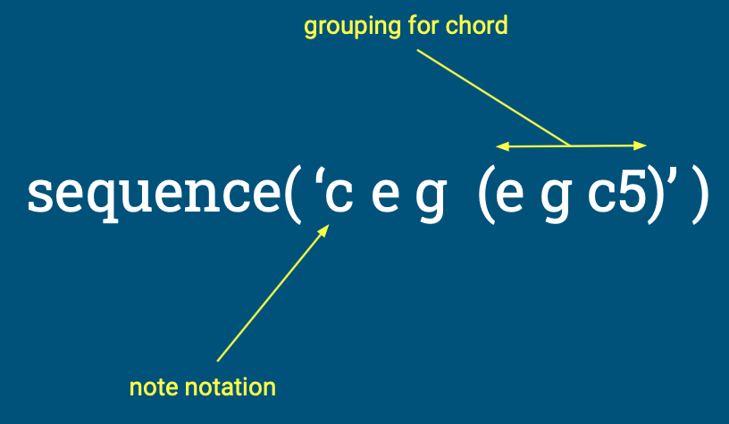
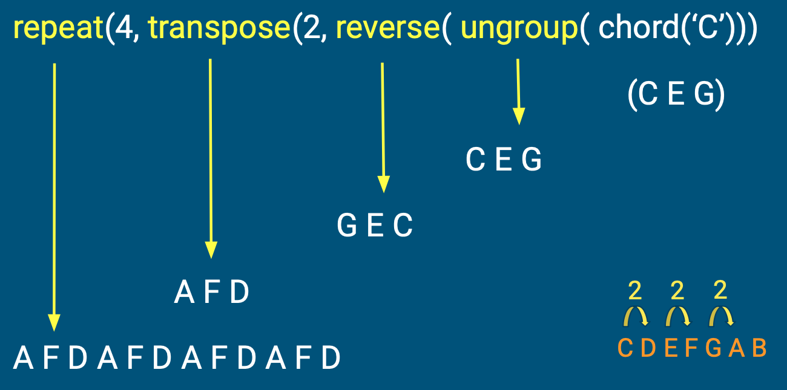
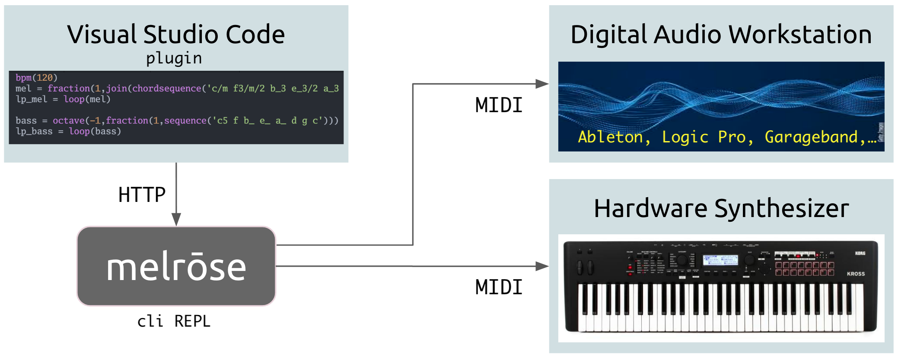

# Melrōse, program and play music

#### Ernest Micklei, October 2022

---
# Motivation

- Explore patterns in music expressed by programming constructs

- Create a simple but expressive language

- Offer quick audio feedback

---
# What is Melrōse ?

- Language to create music, as programs

- Runtime environment to play programs

---

---

---
# Other music primitives

    chord('c#/m')

    scale(2,'8g#3')

    progression('2c#', 'I VI II V')

    chordsequence('a3 b3 c#/m')

---
# Composition

---
# Drum patterns

`notemap` can create a sequence using `dots and bangs`.
    
    kick = note('16c2')

    channel(10, notemap('!...!...!...!...', kick))

---
# Merge

    kick = note('c2')
    snare = note('e2')
    closehi = midi(4,42,72)

    drum14 = merge(
        notemap('!.!....!.!!!...!',kick),
        notemap('....!.......!...',snare),
        notemap('!.!.!.!.!.!.!.!.',closehi))

    bpm(120)
    channel(10,repeat(4,fraction(16,drum14)))

---
# No sound

Melrōse does not produce any sound directly.

The tool sends `MIDI`.

---
# MIDI communication

---
# Show me and let's hear it!

---
# Source bits

- Open source, MIT licensed

- github.com/emicklei/melrose

- https://melrōse.org

- (music) contributions are welcome

