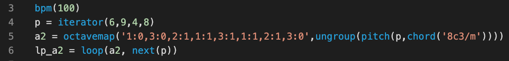

# Melrōse, program and play music

#### Ernest Micklei, October 2022

---
# What is Melrōse ?

- Expression language to create music, like programs

- Runtime to play programs

---

---

---
# Examples: sequence

    sequence('c d e f g a b 1c5 8c5 8a 8b 8g 8e 8f 8g (1c 1e 1g)')

&nbsp;

Merge sequences

    s = sequence(' e  g#  c#5  e5      f#  a  c#5 f#5     g#  b  d#5 g#5   a5 g#5 f#5 e5')
    t = sequence('2e2    2c#2         2f#2   2c#3        2g#2   2d#3')

    repeat(3,fraction(8,merge(s,t)))

---
# Other music primitives

    chord('c#/m')

    scale(2,'8g#3')

    progression('2c#', 'I VI II V')

    chordsequence('a3 b3 c#/m')

---
# Composition

---
# Drum patterns

`notemap` can create a sequence using `dots and bangs`.

&nbsp;

    kick = note('16c2')

    channel(10, notemap('!...!!..!!!...!', kick))

---
# Merge patterns of notes

    kick = note('c2')
    snare = note('b2')
    closehi = midi(4,53,72)

    drums = merge(
        notemap('!.!....!.!!!...!',kick),
        notemap('....!.......!...',snare),
        notemap('!.!.!.!.!.!.!.!.',closehi))

    channel(10,repeat(4,fraction(16,drums)))

---
# No sound

Melrōse does not produce any sound directly.

The tool sends `MIDI`

---
# MIDI communication

---
# Show me and let's hear it!

---
# Thank you for listening !

- Open source, MIT licensed

- github.com/emicklei/melrose

- https://melrōse.org

- (music) contributions are welcome

