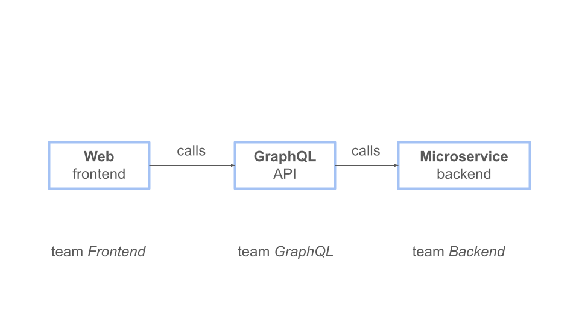
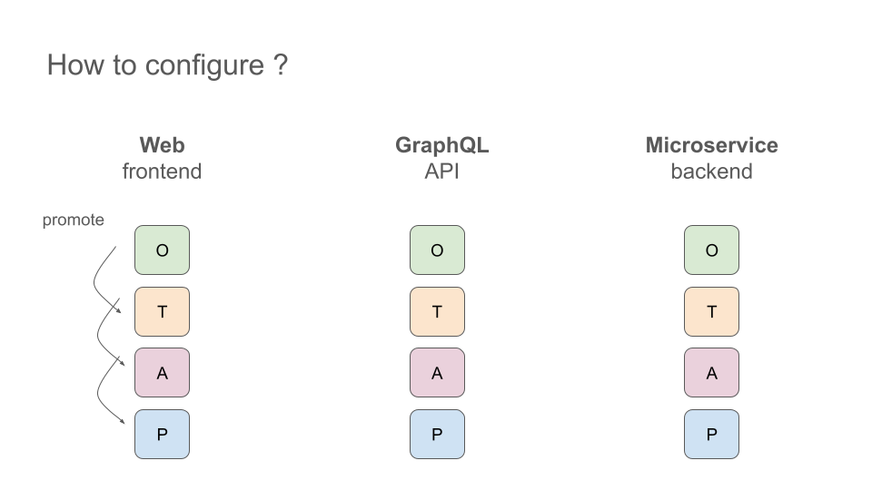
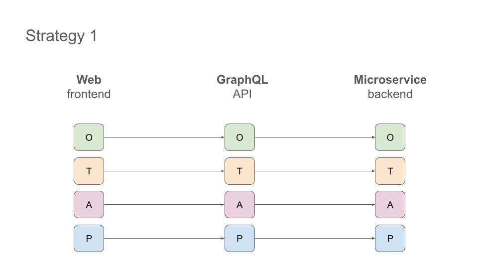
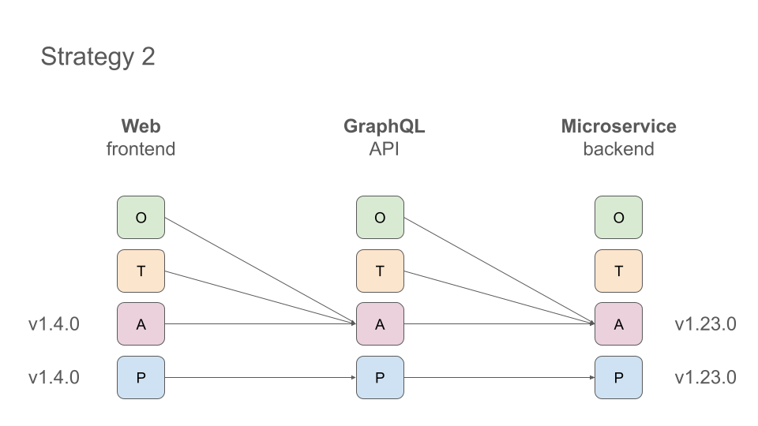
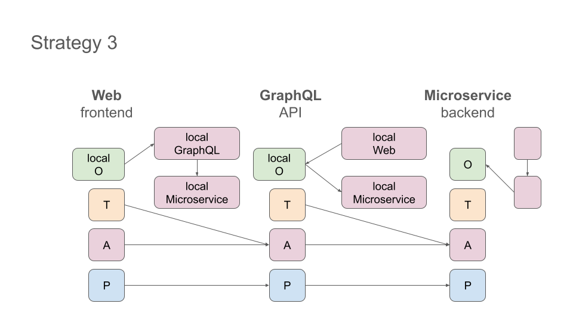
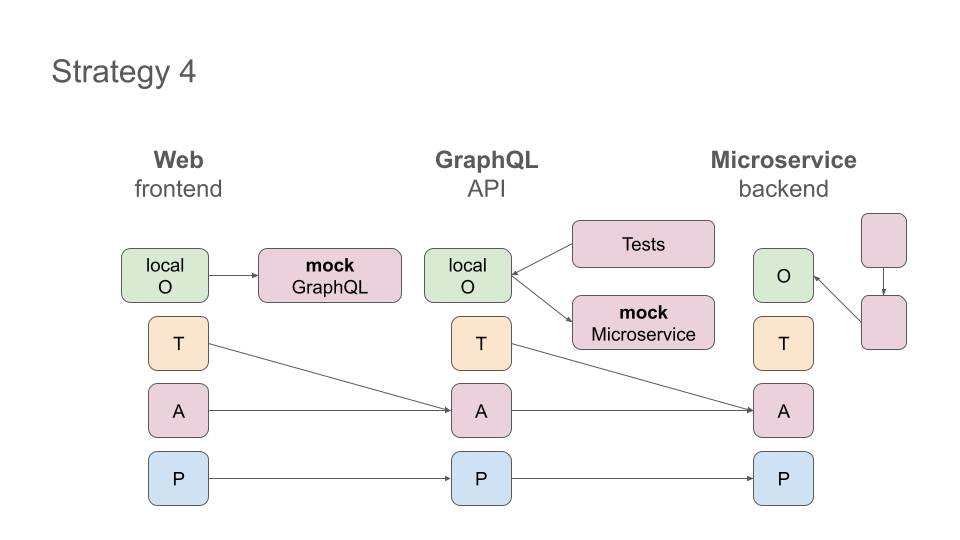
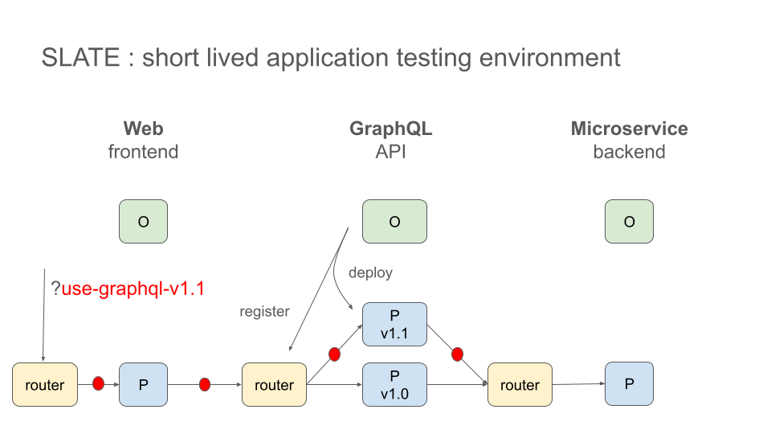
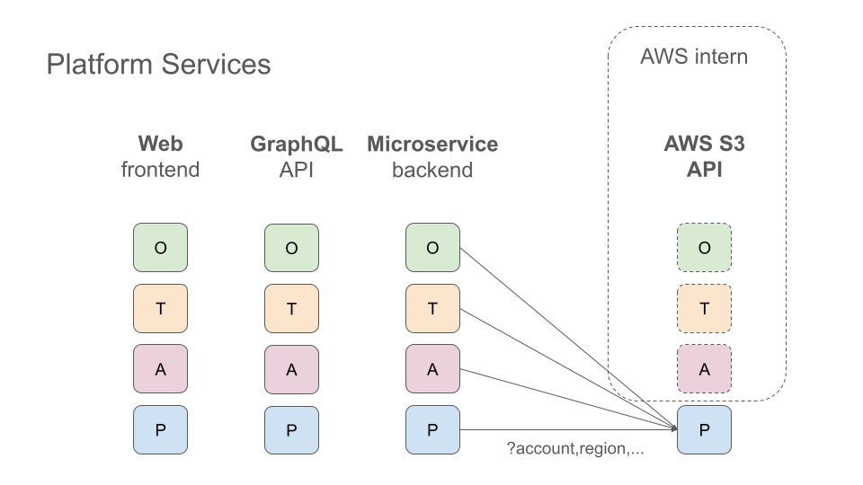

# State of OTAP
September 2026, Kickoff Platform Engineering

### Ernest Micklei

- Software Artist
- Platform Engineer
- Cloud Architect
- Cloud Architect

---
# Who am i

- chief platform engineering (day) 
- open-source developer (night)
    - **go-restful** - REST-ful framework (part of k8s)
    - **melrōse** - Music programming
    - **proto** - ProtocolBuffers parser
    - **dot** - Graphviz DOT writer
    - **pgtalk** - Postgres access code generator

---
# Why OTAP ?

---
# Why OTAP?

---
# Typical Multi-tier Web Application

---
# Connecting Deployed Components

---
# Naive Approach

---
# Stable, production-like backends

---
# Better isolation for development

---
# Mock their APIs

---
# What if you have Uber.com scale ?

---
# SLATE (Uber)

Short-Lived Application Testing Environments

- **on-demand, ephemeral**
- **production fidelity**
- **tenancy-based routing**
- **data isolation** 
    - test accounts, tenancy-aware Kafka, isolated resources keep test traffic from touching real users

---
# Typical Multi-tier Web Application

---
# thank you

Slide deck (Creative Commons)

**github.com/emicklei/talks**

